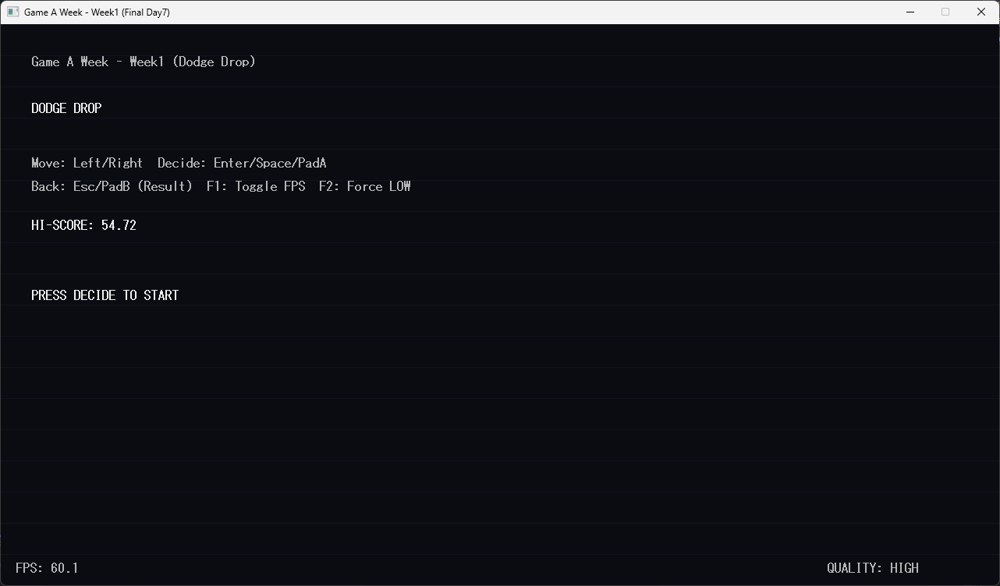
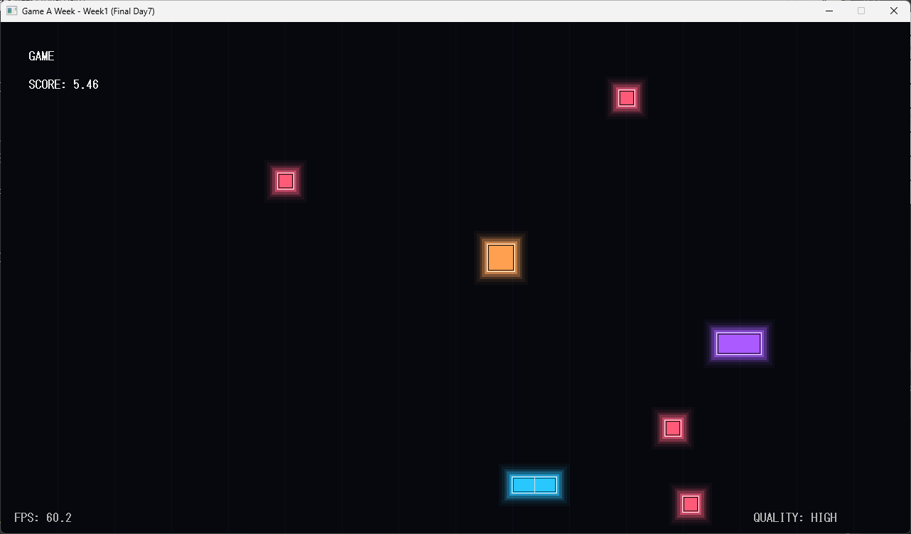
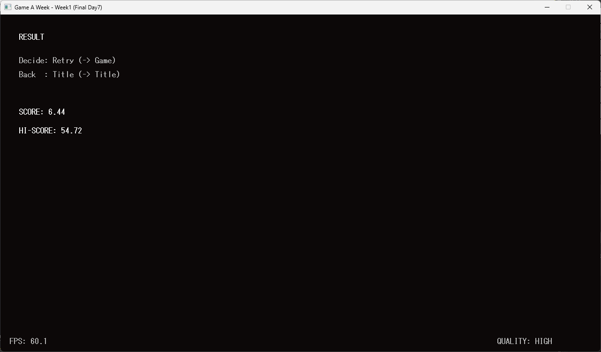

# 🎮 Game A Week - Week01  
## Dodge Drop (DxLib / C++)

DxLib + C++ で制作した 2D回避ゲームです。  
1週間で完成させる「Game A Week」チャレンジ第1作目です。

---

# 📸 Screenshots

| Title   | Game    | Result  |
| ------- | ------- | ------- |
|   |  |  |

---

# 🎮 ゲーム概要

プレイヤーを左右に移動させ、上から落ちてくる敵を避け続けるゲームです。

- 解像度：1280 × 720
- 目標FPS：60（最低30FPS保証）
- 疑似Bloom（加算合成）による発光表現
- 自動Quality切替（FPS低下時に軽量化）

---

# 🕹 操作方法

| 操作 | キーボード | パッド |
|------|------------|--------|
| 左移動 | ← / A | D-Pad Left |
| 右移動 | → / D | D-Pad Right |
| 決定 | Enter / Space | A |
| 戻る | Esc | B |
| FPS表示切替 | F1 | - |
| 強制LOW品質 | F2 | - |

---

# 🧠 ゲームルール

- 敵に当たるとゲームオーバー
- 生存時間がスコア
- ハイスコアはローカル保存（hiscore.dat）

---

# 🛠 開発環境

- OS : Windows 10 / 11
- 言語 : C++
- IDE : Visual Studio 2022
- ライブラリ : DxLib

---

# 🚀 セットアップ手順（DxLib含む）

## ① DxLib をダウンロード

1. 公式サイトから最新版をダウンロード  
   👉 https://dxlib.xsrv.jp/

2. 「VisualStudio用」を選択

3. zipを解凍

---

## ② Visual Studio プロジェクト作成

1. Visual Studio を起動
2. 「新しいプロジェクト」
3. **空のプロジェクト（C++）** を選択
4. プロジェクト名を設定（例：DodgeDrop）
5. 作成

---

## ③ DxLib をプロジェクトに組み込む

### 1. DxLib のファイルをコピー

DxLib フォルダ内の以下をプロジェクトフォルダにコピー：


DxLib.lib
DxLib.h
DxLib.dll


※ 64bitで作る場合は x64 用を使用

---

### 2. インクルード設定

プロジェクト → 右クリック → プロパティ

**C/C++ → 全般 → 追加のインクルードディレクトリ**


DxLibのフォルダパス


---

### 3. ライブラリ設定

**リンカー → 全般 → 追加のライブラリディレクトリ**


DxLibのフォルダパス


**リンカー → 入力 → 追加の依存ファイル**


DxLib.lib


---

### 4. 文字セット設定

**構成プロパティ → 全般 → 文字セット**

→ 「マルチバイト文字セットを使用する」に変更

---

### 5. C++標準を C++17 以上に設定（重要）

**C/C++ → 言語 → C++言語標準**


ISO C++17 (/std:c++17)


---

### 6. NOMINMAX を追加（min/max問題回避）

**C/C++ → プリプロセッサ → プリプロセッサの定義**

追加：


NOMINMAX


---

## ④ ソースコード追加

このリポジトリの `src/` 以下をプロジェクトに追加。

- .cpp は「既存項目の追加」
- フォルダ構造は揃えなくてもOK（整理推奨）

---

## ⑤ assets フォルダ配置

実行ファイルと同じ階層に：

```text
assets/
bgm.wav
se_decide.wav
se_back.wav
se_hit.wav
```

---

## ⑥ ビルド

構成：

- Release
- x64（推奨）

ビルド → 実行

---

# 📂 ディレクトリ構成

```text
src/
Core/
Scene/
Game/
Input/
Audio/
Render/
assets/
README.md
```

---

# ⚙ パフォーマンス設計

- 1秒平均FPS計測
- FPS < 30 で自動的に LOW品質へ
- LOW時の軽量化：
  - Glow層数削減
  - 背景線間引き

---

# 🔊 使用素材

- BGM : 
- SE  : 

※各素材のライセンスに従ってください

---

# 📜 ライセンス

This project is released under the MIT License.

---

# 🧭 Game A Week について

毎週1本ゲームを完成させる挑戦企画。

Week01 : Dodge Drop  
Week02 : (coming soon)

---

# ✨ 今後の改善予定

- unique_ptr化（new/delete削減）
- ニアミス判定追加
- スコア演出強化
